# Hexo Mermaid renderer 

Initial work -> [Onewe/hexo-filter-mermaid-diagrams](https://github.com/onewe/hexo-filter-mermaid-diagrams). 

# Demo 
1. [Build Process](https://www.otienoken.me/build-tools/build-with-scons/#Summary)
2. [DevOps Pipeline](https://www.otienoken.me/devops/devops-with-bitbucket-pipelines/#DevOps-pipeline)

# Usage 

## Install 

Using either `NPM` or `Yarn`

### NPM     
`npm install --save TheBeachMaster/hexo-filter-mermaid` 

### Yarn  

`yarn add TheBeachMaster/hexo-filter-mermaid` 

## Config

In your root `_config.yml` add this
```
# mermaid chart
mermaid: 
  enable: true  # default
  options:  
    startOnload: true  
    theme: dark
```

More `options` [here](https://github.com/knsv/mermaid/blob/master/src/mermaidAPI.js)
Note about themes: selection {`default`, `forest`, `dark`, `neutral`}. You can only have one (for now)

## Mermaid Diagrams 
```
```mermaid 
graph LR
  subgraph Continuous Integration
        delbuild[Build]-.-> deltest[Test]
       depbuild[Build]-.-> deptest[Test]
    end
  subgraph Continuous Delivery
   deltest-.->delaccept[Acceptance Test]
   delaccept-.->delstage[Deploy to Staging]
   delstage-->delprod[Deploy to Production]
   delprod-->delsmoketest[Smoke Test]
   end
 subgraph Continuos Deployment
   deptest-.->depaccept[Acceptance Test]
   depaccept-.->depstage[Deploy to Staging]
   depstage-.->depprod[Deploy to Production]
   depprod-.->depsmoketest[Smoke Test]
 end ``` 
 ```
 

For more demos see [Mermaid API demos](https://mermaidjs.github.io/demos.html) 

## Issues

If you run into rendering issues, use Hexo's [`raw`](https://hexo.io/docs/tag-plugins#Raw) tag like so 

```
 
```mermaid 
graph LR
  subgraph Continuous Integration
        delbuild[Build]-.-> deltest[Test]
       depbuild[Build]-.-> deptest[Test]
    end
  subgraph Continuous Delivery
   deltest-.->delaccept[Acceptance Test]
   delaccept-.->delstage[Deploy to Staging]
   delstage-->delprod[Deploy to Production]
   delprod-->delsmoketest[Smoke Test]
   end
 subgraph Continuos Deployment
   deptest-.->depaccept[Acceptance Test]
   depaccept-.->depstage[Deploy to Staging]
   depstage-.->depprod[Deploy to Production]
   depprod-.->depsmoketest[Smoke Test]
 end```
 
 ```

Note that in the above examples `end` tag should be proceeded by a new line then ``` ...