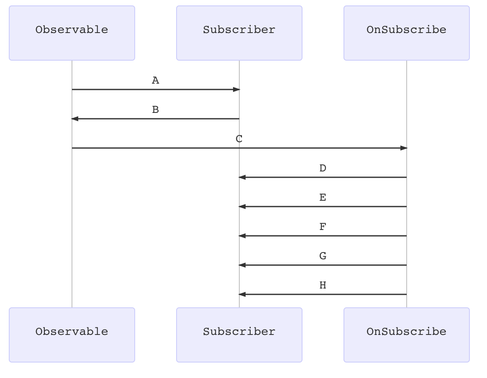

2. ```
   ​```mermaid
   sequenceDiagram
   Observable->>Subscriber:A;
   Subscriber->>Observable:B;
   Observable->>OnSubscribe:C;
   OnSubscribe->>Subscriber:D;
   OnSubscribe->>Subscriber:E;
   OnSubscribe->>Subscriber:F;
   OnSubscribe->>Subscriber:G;
   OnSubscribe->>Subscriber:H;
   ​```
   ```

3. 
